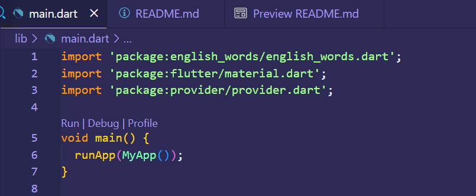
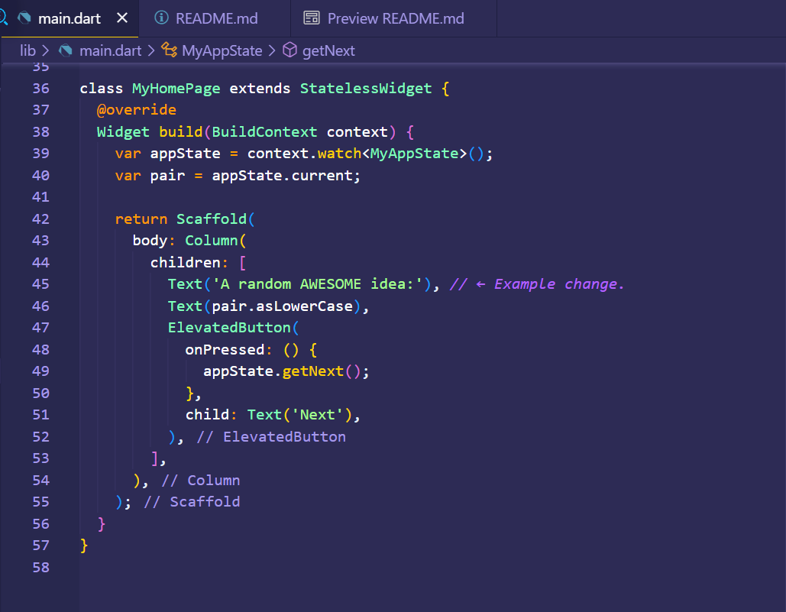
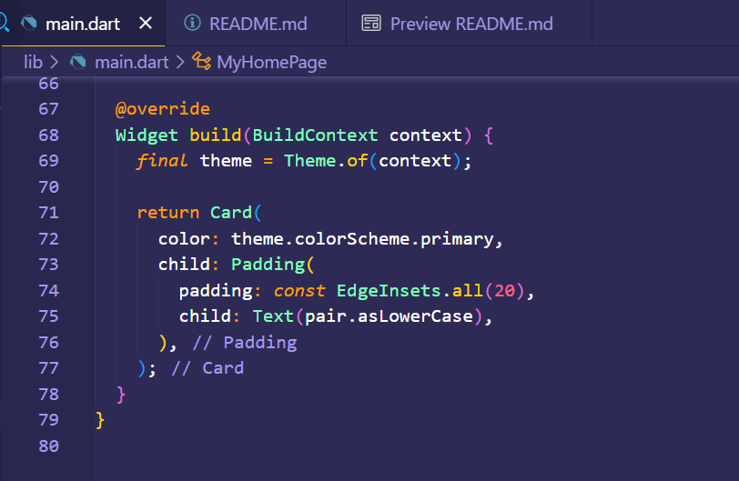

 

  <h3 align="center">PEMROGRAMAN MOBILE</h3>
    
  
    
  <h3 align="center">Falendika Tegar Pratama</h3>
  <h3 align="center">3G - D4TI</h3>

 

<h1 align="center">Laporan Flutter Codelabs</h1>

 

<!-- ABOUT THE PROJECT -->
## Membuat project

### Membuat proyek Flutter pertama Anda

Luncurkan Visual Studio Code dan buka palet perintah (dengan F1 atau Ctrl+Shift+P atau Shift+Cmd+P). Ketik "flutter new". Pilih perintah Flutter: New Project.

 

Berikutnya, pilih Application lalu folder tempat proyek akan dibuat. Folder ini dapat berupa direktori utama Anda, atau direktori seperti C:\src\.

Terakhir, beri nama proyek Anda. Beri nama seperti namer_app atau my_awesome_namer.

 

Flutter kini membuat folder proyek Anda dan VS Code membuka folder tersebut.

Anda sekarang akan menimpa isi 3 file dengan scaffold dasar aplikasi.

### Menyalin & Menempelkan aplikasi awal

Pada panel sebelah kiri VS Code, pastikan bahwa Penjelajah dipilih lalu buka file pubspec.yaml.

 

Ganti konten file ini dengan kode berikut:

 

File pubspec.yaml menentukan informasi dasar tentang aplikasi Anda, seperti versi aplikasi saat ini, dependensi aplikasi, dan aset yang digunakan oleh aplikasi untuk pengiriman.

Berikutnya, buka file konfigurasi lainnya dalam proyek tersebut, analysis_options.yaml.

Ganti konten file tersebut dengan kode berikut:

 

File ini menentukan seberapa ketat Flutter saat menganalisis kode Anda. Karena percobaan ini adalah percobaan pertama Anda menggunakan Flutter, Anda memberi tahu penganalisis agar tidak terlalu ketat. Anda dapat mengatur ini kapan saja. Bahkan, seiring mendekati pemublikasian aplikasi produksi sebenarnya, Anda kemungkinan besar akan ingin membuat penganalisis lebih ketat dari ini.

Terakhir, buka file main.dart pada direktori lib/.

Ganti konten file ini dengan kode berikut:

 

50 baris kode ini adalah keseluruhan aplikasi sejauh ini.

Pada bagian berikutnya, jalankan aplikasi dalam mode debug dan mulai kembangkan aplikasi Anda.

## Membuat project

### Meluncurkan aplikasi

Pertama, buka lib/main.dart dan pastikan Anda memilih perangkat target. Di bagian pojok kanan bawah VS Code, Anda akan menemukan tombol yang menampilkan perangkat target saat ini. Klik tombol untuk mengubahnya.

 

Selagi lib/main.dart terbuka, temukan tombol "play" di pojok kanan atas jendela VS Code lalu klik tombol tersebut.

 

Setelah beberapa saat, aplikasi Anda diluncurkan dalam mode debug. Tampilannya masih terlihat biasa saja:

### Meluncurkan aplikasi

Di bagian bawah lib/main.dart, tambahkan sesuatu pada string di objek Text pertama, dan simpan file tersebut (dengan Ctrl+S atau Cmd+S). Misalnya:

 

Perhatikan bagaimana aplikasi segera berubah tetapi kata yang acak tetap sama. Situasi ini menunjukkan fitur stateful Hot Reload Flutter terkenal yang sedang bekerja. Hot reload dipicu saat Anda menyimpan perubahan untuk file sumber.

### Menambahkan tombol

Berikutnya, tambahkan tombol di bagian bawah Column, tepat di bawah instance Text kedua.

 

Saat Anda menyimpan perubahan, aplikasi diperbarui kembali: Sebuah tombol muncul dan, saat Anda mengklik tombol tersebut, Konsol Debug di VS Code menampilkan pesan button pressed!.

### Kursus singkat Flutter 5 menit

Meskipun menyenangkan melihat Konsol Debug, Anda ingin tombol tersebut melakukan sesuatu yang lebih berguna. Namun, sebelum mencapai ke sana, perhatikan kode pada lib/main.dart lebih dekat, untuk memahami cara kerjanya.

 

Di bagian paling atas file tersebut, Anda akan menemukan fungsi main(). Dalam wujudnya saat ini, fungsi ini hanya memberi tahu Flutter untuk menjalankan aplikasi yang ditentukan pada MyApp.

 

Class MyApp memperluas StatelessWidget. Widget adalah elemen tempat Anda membangun setiap aplikasi Flutter. Seperti yang dapat Anda lihat, bahkan aplikasi itu sendiri adalah widget.

Kode pada MyApp menyusun keseluruhan aplikasi. Kode ini membuat status seluruh aplikasi (Anda akan mempelajari hal ini lebih lanjut nanti), memberi nama aplikasi, menentukan tema visual, dan mengatur widget "home"—titik awal aplikasi Anda.

 

Berikutnya, class MyAppState menentukan...yah...status aplikasi. Percobaan ini adalah percobaan pertama Anda menggunakan Flutter, jadi codelab ini akan menjaga status aplikasi tetap sederhana dan terpusat. Ada banyak cara ampuh untuk mengelola status aplikasi di Flutter. Salah satu yang paling mudah untuk dijelaskan adalah ChangeNotifier, pendekatan yang diambil oleh aplikasi ini.
- MyAppState menjelaskan data yang diperlukan oleh aplikasi ini agar berjalan dengan baik. Saat ini, kode ini hanya berisi variabel tunggal dengan pasangan kata acak saat ini. Anda akan menambahkannya nanti.
- Class status memperluas ChangeNotifier, yang artinya kode ini dapat memberi tahu kode lain tentang perubahannya sendiri. Misalnya, jika pasangan kata saat ini berubah, beberapa widget dalam aplikasi perlu mengetahuinya.
- Status dibuat dan disediakan untuk seluruh aplikasi menggunakan ChangeNotifierProvider (lihat kode di atas pada MyApp). Hal ini memungkinkan widget mana pun pada aplikasi untuk mendapatkan status.

 

Terakhir, ada MyHomePage, widget yang telah Anda modifikasi. Setiap baris bernomor di bawah memetakan ke komentar nomor baris pada kode di atas:
1. Setiap widget menentukan metode build() yang dipanggil secara otomatis setiap kali kondisi widget berubah agar widget selalu dalam kondisi terbaru.
2. MyHomePage melacak perubahan terhadap status aplikasi saat ini menggunakan metode watch.
3. Setiap metode build harus menampilkan widget atau (yang lebih umum) pohon widget bertingkat. Dalam hal ini, widget tingkat tertinggi adalah Scaffold. Anda tidak akan bekerja dengan Scaffold dalam codelab ini, tetapi ini adalah widget yang berguna dan dapat ditemukan di sebagian besar aplikasi Flutter di dunia nyata.
4. Column adalah salah satu widget tata letak paling dasar pada Flutter. Widget tata letak ini mengambil sejumlah turunan dan menempatkannya pada kolom dari atas ke bawah. Secara default, kolom menempatkan turunan-turunannya secara visual di bagian atas. Anda akan segera mengubah ini agar kolom terpusat di tengah.
5. Anda mengubah widget Text ini pada langkah pertama.
6. Widget Text kedua ini mengambil appState, dan mengakses satu-satunya anggota dari class tersebut, current (yang merupakan WordPair). WordPair menyediakan beberapa pengambil yang berguna, seperti asPascalCase atau asSnakeCase. Di sini, kita menggunakan asLowerCase, tetapi Anda dapat mengubah ini sekarang jika Anda lebih menyukai salah satu alternatif yang ada.
7. Perhatikan bagaimana kode Flutter banyak menggunakan koma di akhir. Koma ini tidak harus ada, karena children adalah anggota terakhir (dan juga satu-satunya) dari daftar parameter Column ini. Namun, menggunakan koma di akhir umumnya adalah ide yang bagus: koma di akhir membuat penambahan anggota menjadi mudah, dan koma di akhir juga berfungsi sebagai petunjuk bagi pemformat otomatis Dart untuk meletakkan baris baru. Untuk informasi lebih lanjut, lihat panduan Pemformatan kode.

Berikutnya, Anda akan menghubungkan tombol dengan status.

### Perilaku pertama Anda

Scroll ke MyAppState lalu tambahkan metode getNext.

 

Metode getNext() baru menetapkan ulang current dengan WordPair acak baru. Metode ini juga memanggil notifyListeners()(metode ChangeNotifier) yang memastikan bahwa semua orang yang melihat MyAppState diberi tahu.

Tindakan terakhir adalah memanggil metode getNext dari callback tombol tersebut.

 

Simpan dan uji coba aplikasi sekarang. Aplikasi akan menghasilkan pasangan kata acak baru setiap kali Anda menekan tombol Next.

Pada bagian berikutnya, Anda akan memperindah tampilan antarmuka pengguna.

## Memperindah tampilan aplikasi

Gambar berikut menunjukkan tampilan aplikasi saat ini.

 

Tidak bagus. Bagian utama aplikasi—pasangan kata yang dihasilkan secara acak—harus lebih terlihat. Lagipula, bagian ini adalah alasan utama pengguna kita menggunakan aplikasi ini! Selain itu, konten aplikasi terlihat melenceng sekaligus aneh, dan tampilan hitam & putih aplikasi terkesan membosankan.

Bagian ini membahas masalah ini melalui pengerjaan desain aplikasi. Tujuan akhir bagian ini adalah sesuatu seperti berikut:

### Mengekstrak widget

Baris yang bertanggung jawab untuk menampilkan pasangan kata saat ini kini tampak seperti berikut: Text(appState.current.asLowerCase). Untuk mengubahnya menjadi sesuatu yang lebih kompleks, disarankan untuk mengekstrak baris ini ke widget terpisah. Memiliki beberapa widget untuk beberapa bagian logis dari UI Anda adalah cara penting dalam mengelola kompleksitas pada Flutter.

Flutter menyediakan pembantu pemfaktoran ulang untuk mengekstrak widget, tetapi sebelum Anda menggunakannya, pastikan bahwa baris yang akan diekstrak hanya mengakses yang diperlukan. Sekarang baris tersebut mengakses appState, tetapi sebenarnya baris tersebut hanya perlu mengetahui apa pasangan kata saat ini.

Oleh karena itu, tulis ulang widget MyHomePage sebagai berikut:

 

Bagus. Widget Text tidak lagi merujuk kepada keseluruhan appState.

Sekarang, panggil menu Refactor. Pada VS Code, Anda melakukan ini melalui salah satu dari dua cara:
1. Klik kanan potongan kode yang ingin Anda faktorkan ulang (dalam hal ini Text) dan pilih Refactor... dari menu drop-down,

ATAU

2. Pindahkan kursor Anda ke potongan kode yang ingin Anda faktorkan ulang (dalam hal ini, Text), lalu tekan Ctrl+. (Win/Linux) atau Cmd+. (Mac).

Pada menu Refactor, pilih Extract Widget. Tetapkan nama, seperti BigCard, lalu klik Enter.

Tindakan ini secara otomatis membuat class baru, BigCard, di akhir file saat ini. Class tersebut akan terlihat seperti berikut:

 

Perhatikan bagaimana aplikasi tetap berjalan meskipun pemfaktoran ulang sedang berlangsung.

### Menambahkan Kartu

Sekarang saatnya membuat widget baru ini menjadi UI tebal yang kita bayangkan di awal bagian ini.

Temukan class BigCard dan metode build() yang berada di dalamnya. Sama seperti sebelumnya, panggil menu Refactor pada widget Text. Namun, kali ini Anda tidak akan mengekstrak widget.

Sebagai gantinya, pilih Wrap with Padding. Tindakan ini menciptakan widget induk baru di sekitar widget Text bernama Padding. Setelah menyimpannya, Anda akan melihat bahwa kata acak tersebut telah memiliki ruang yang lebih luas.

Tingkatkan padding dari nilai default 8.0. Misalnya, gunakan 20 untuk padding yang lebih luas.

 

Berikutnya, mari kita naik satu tingkat lebih tinggi. Tempatkan kursor Anda pada widget Padding, buka menu Refactor, lalu pilih Wrap with widget....

Tindakan ini memungkinkan Anda untuk menentukan widget induk. Ketik "Card" dan tekan Enter.

 

Kode ini menggabungkan widget Padding, dan juga Text, dengan widget Card.

### Tema dan gaya

Untuk membuat kartu menjadi lebih menarik, beri warna yang lebih kaya pada kartu tersebut. Karena ada baiknya untuk menjaga skema warna yang konsisten, gunakan Theme aplikasi untuk memilih warna.

Buat perubahan berikut untuk metode build() BigCard.

 

Kedua baris baru ini melakukan banyak hal:
- Pertama, kode ini meminta tema aplikasi saat ini dengan Theme.of(context).
- Kemudian, kode ini menentukan warna kartu agar sama dengan properti colorScheme dari tema. Skema warna menampung banyak warna, dan primary adalah warna aplikasi yang paling terlihat dan mencolok.

Kini, kartu telah diwarnai dengan warna primer aplikasi:

 

Anda dapat mengubah warna ini serta skema warna keseluruhan aplikasi dengan men-scroll ke atas ke MyApp dan mengubah warna seed untuk ColorScheme di sana.

 

Perhatikan bagaimana warna berubah dengan halus. Perubahan ini disebut animasi implisit. Banyak widget Flutter akan berinterpolasi antarnilai dengan lancar agar UI tidak hanya "berpindah" antarstatus.

Tombol timbul di bawah kartu juga berubah warna. Itulah kelebihan dalam menggunakan Theme seluruh aplikasi dibandingkan dengan nilai hard-code.

### TextTheme

Kartu tersebut masih memiliki masalah: ukuran teks terlalu kecil dan warnanya membuat teks sulit dibaca. Untuk memperbaiki masalah ini, buat perubahan berikut pada metode build() BigCard.

Yang ada di balik perubahan ini:
- Dengan menggunakan theme.textTheme,, Anda mengakses tema font aplikasi. Class ini mencakup anggota seperti bodyMedium (untuk teks standar ukuran medium), caption (untuk teks dari gambar), atau headlineLarge (untuk judul berukuran besar).
- Properti displayMedium adalah gaya font besar yang dimaksudkan untuk teks tampilan. Kata tampilan digunakan dalam artian tipografi di sini, seperti pada jenis huruf tampilan. Dokumentasi untuk displayMedium menyatakan bahwa, "gaya tampilan ditujukan untuk teks yang penting dan singkat"—tepat dengan kasus penggunaan kita.
- Properti displayMedium tema secara teori dapat berupa null. Dart, bahasa pemrograman yang Anda gunakan untuk menulis aplikasi ini, aman dari null, sehingga bahasa pemrograman ini tidak akan mengizinkan Anda memanggil metode objek yang berpotensi null. Namun, dalam hal ini, Anda dapat menggunakan operator ! ("bang operator") untuk meyakinkan Dart bahwa Anda memahami tindakan Anda. (displayMedium pasti tidak null dalam kasus ini. Namun, alasan kami mengetahui hal ini berada di luar cakupan codelab ini.)
- Memanggil copyWith() pada displayMedium menampilkan salinan gaya teks dengan perubahan yang Anda tentukan. Dalam hal ini, Anda hanya mengubah warna teks.
- Untuk mendapatkan warna baru, Anda mengakses tema aplikasi sekali lagi. Properti onPrimary skema warna menentukan warna yang cocok digunakan untuk warna primer aplikasi.

Kini, aplikasi akan terlihat seperti berikut:

Jika Anda mau, ubah kartu lebih jauh. Berikut beberapa idenya:
- copyWith() memungkinkan Anda mengubah lebih banyak tentang gaya teks daripada hanya warna. Untuk mendapatkan daftar lengkap properti yang dapat Anda ubah, letakkan kursor di dalam tanda kurung copyWith(), lalu tekan Ctrl+Shift+Space (Win/Linux) atau Cmd+Shift+Space (Mac).
- Anda juga dapat mengubah lebih banyak tentang widget Card. Misalnya, Anda dapat memperbesar bayangan kartu dengan meningkatkan nilai parameter elevation.
- Coba bereksperimen dengan warna. Selain theme.colorScheme.primary, ada juga .secondary, .surface, dan berbagai pilihan lainnya. Semua warna ini memiliki onPrimary padanannya masing-masing.

### Meningkatkan aksesibilitas

Flutter membuat aplikasi dapat diakses secara default. Misalnya, setiap aplikasi Flutter menampilkan semua teks dan elemen interaktif di aplikasi dengan tepat untuk pembaca layar, seperti TalkBack dan VoiceOver.

 

Namun, terkadang diperlukan pengerjaan tambahan. Dalam kasus aplikasi ini, pembaca layar mungkin mengalami masalah dalam melafalkan beberapa pasangan kata yang dihasilkan. Meskipun manusia tidak mengalami masalah dalam mengidentifikasi kedua kata pada pasangan kata cheaphead, pembaca layar dapat melafalkan ph di tengah kata sebagai f.

Solusi sederhananya adalah dengan mengganti pair.asLowerCase dengan "${pair.first} ${pair.second}". Kode kedua menggunakan jenis interpolasi string untuk membuat string (seperti "cheap head") dari kedua kata yang tercakup dalam pair. Menggunakan dua kata terpisah sebagai ganti kata majemuk memastikan bahwa pembaca layar mengidentifikasi setiap kata dengan tepat, dan menyediakan pengalaman yang lebih baik untuk pengguna penyandang gangguan penglihatan.

Solusi sederhananya adalah dengan mengganti pair.asLowerCase dengan "${pair.first} ${pair.second}". Kode kedua menggunakan jenis interpolasi string untuk membuat string (seperti "cheap head") dari kedua kata yang tercakup dalam pair. Menggunakan dua kata terpisah sebagai ganti kata majemuk memastikan bahwa pembaca layar mengidentifikasi setiap kata dengan tepat, dan menyediakan pengalaman yang lebih baik untuk pengguna penyandang gangguan penglihatan.

Namun, Anda mungkin ingin mempertahankan kesederhanaan visual pair.asLowerCase. Gunakan properti semanticsLabel Text untuk mengganti konten visual widget teks dengan konten semantik yang lebih sesuai untuk pembaca layar:

 

Kini, pembaca layar melafalkan setiap pasangan kata yang dihasilkan dengan tepat, namun UI tidak berubah. Coba praktikkan ini dengan menggunakan pembaca layar di perangkat Anda.

### Menempatkan UI di tengah

Setelah pasangan kata acak dihadirkan dengan gaya visual yang cukup, saatnya menempatkan UI di tengah jendela/layar aplikasi.

Pertama, ingatlah bahwa BigCard adalah bagian dari Column. Secara default, kolom menggabungkan turunan kolom di bagian atas, tetapi kita dapat mengganti ini dengan mudah. Buka metode build() MyHomePage, dan buat perubahan berikut:

 

Tindakan ini menempatkan turunan dalam Column di tengah pada sumbu utamanya (vertikal).

 

Turunan UI telah ditempatkan di tengah pada sumbu silang kolom (dengan kata lain, turunan UI telah ditempatkan di tengah secara horizontal). Namun, Column itu sendiri tidak ditempatkan di tengah dalam Scaffold. Kita dapat memverifikasi ini menggunakan Widget Inspector.

 

Widget Inspector itu sendiri berada di luar cakupan codelab ini, tetapi Anda dapat melihat bahwa ketika Column ditandai, kode ini tidak menghabiskan keseluruhan lebar aplikasi. Kode ini hanya menghabiskan ruang horizontal sebanyak yang diperlukan oleh turunan UI.

Anda dapat menempatkan kolom itu sendiri di tengah. Letakkan kursor Anda di Column, buka menu Refactor (dengan Ctrl+. atau Cmd+.), lalu pilih Wrap with Center.

 

Kini, aplikasi akan terlihat seperti berikut:

 

Jika mau, Anda dapat menyesuaikan tampilan ini lebih lanjut.
- Anda dapat menghapus widget Text di atas BigCard. Dapat dipastikan bahwa teks deskriptif ("Ide LUAR BIASA acak:") tidak lagi diperlukan karena UI tersebut sudah jelas meskipun tanpa teks deskriptif. Selain itu, dengan begitu UI terlihat lebih bersih.
- Anda juga dapat menambahkan widget SizedBox(height: 10) di antara BigCard dan ElevatedButton. Dengan begitu, ada sedikit pemisah di antara kedua widget tersebut. Widget SizedBox hanya mengambil ruang dan tidak merender apa pun dengan sendirinya. Widget ini biasa digunakan untuk membuat "jarak" visual.

Dengan perubahan opsional, MyHomePage mencakup kode berikut:

 

Aplikasinya akan terlihat seperti berikut:

 

Pada bagian berikutnya, Anda akan menambahkan kemampuan untuk memfavoritkan (atau ‘menyukai') kata-kata yang dihasilkan.

